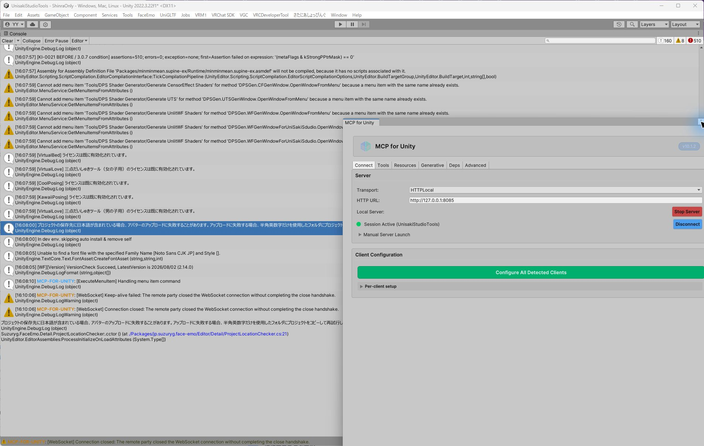
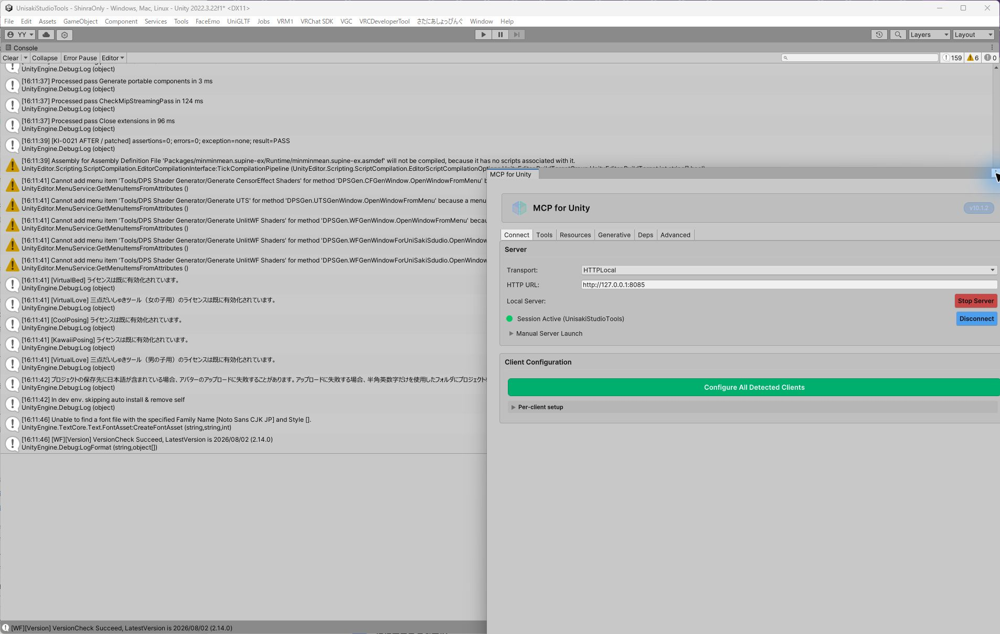

# KI-0021 Unity実機調査・再現・修正レポート

作成日: 2026-08-18

対象: PosingSystem 3.0.7 / issue #58

用途: 別エージェントによる修正レビューとリリース可否判断

## 1. 結論

問い合わせ画像にある「衣装全体がずれる」「腕の衣装がT字で残る」という**最終的な見た目は、手元のShinra検証環境では修正前条件でも再現しなかった**。したがって、本変更だけを根拠に「問い合わせの見た目の不具合が完全に直った」とはまだ断定しない。

一方で、3.0.7の姿勢高さ再補正処理には、同じNDMFビルドを行うたびに確実に再現する別の実不具合が見つかった。NDMFがビルド中に生成した一時AnimationClip/BlendTreeを外部の永続アセットと誤認し、入れ子のMotionを再度 `Object.Instantiate` していた。その結果、Unity内部の参照グラフに対して次のAssertionが1ビルドで**510件**発生した。

```text
Assertion failed on expression: '(metaFlags & kStrongPPtrMask) == 0'
UnityEngine.Object.Instantiate<UnityEditor.Animations.BlendTree>
jp.unisakistudio.posingsystemeditor.PosingSystemConverter.RecalibrateMotion(...)
```

NDMF一時アセットは既にそのビルド専用のコピーであるため再複製せず、その場で補正するよう修正した。同一条件・同一アバター・同一処理で、修正後は**Assertion 0件、Error 0件、例外なし**になった。

この不正な再複製は、問い合わせの「Consoleに通常のエラーが出ず、ビルド自体は進む」「衣装・ボーン参照の壊れ方が環境によって異なる」という特徴と整合する。しかし、Shinraでは修正前でも最終衣装ボーンが正常だったため、顧客環境の見た目まで同じ根本原因であることの最終確認には、再現プロジェクトまたは診断ビルドの結果が必要である。

## 2. 比較スクリーンショット

### 修正前相当（3.0.7のRecalibrateMotion条件）



- Console右上の赤いカウント: `510`
- サマリー: `[KI-0021 BEFORE / 3.0.7 condition] assertions=510; errors=0; exception=none`
- ErrorではなくUnity Assertionであり、NDMF処理は最後まで進む。このため、通常操作だけでは気づきにくい。

### 修正後



- Console右上の赤いカウント: `0`
- サマリー: `[KI-0021 AFTER / patched] assertions=0; errors=0; exception=none; result=PASS`
- 画像中の黄色い警告6件はDPS Shader Generator等の既存プロジェクト警告で、KI-0021のビルドコールバックで数えたError/Exceptionには含まれない。

## 3. 検証環境

| 項目 | 値 |
|---|---|
| Unity | 2022.3.22f1 |
| Scene | `Assets/ShinraOnly.unity` |
| Avatar | ShinraRichWhite |
| PosingSystem | 3.0.7 + 本修正 |
| Modular Avatar | 1.18.1 |
| NDMF | 1.14.4 |
| Skeletal Floor Adjuster | 1.1.2、Y = -0.383 |
| LightLimitChanger | 1.10.1および2.0.0-alpha.5も別途比較 |

LLCなしでも、FloorAdjusterによって高さ再補正が実行されれば510件のAssertionは再現した。したがって、LLCはこの内部不具合の必須条件ではない。問い合わせ元のLLCあり/なし差は、最終的な壊れ方を表面化させる処理順またはアセット構造の差である可能性が残る。

## 4. 通常操作で見た目が再現しない理由

手元のShinraでは、修正前相当でもNDMF完了後の12個のSkinnedMeshRendererについて、衣装側の腕6ボーン参照は本体Humanoidボーンと一致した。つまり、Unity内部ではAssertionが起きても、このアバターの最終的な衣装追従は偶然保たれていた。

問い合わせの見た目が出るには、少なくとも次のいずれかの追加条件が必要と考えられる。

1. Linne / 狛乃 / 問い合わせ元の森羅構成に固有のAnimatorController・BlendTree構造
2. LLCや他のNDMFプラグインによるMotion参照グラフの複製順・処理順
3. プレビルド済みデータの再利用状態
4. 衣装のMerge Armature構造、同名ボーン、Lock Mode等の差
5. UnityがAssertion後も処理を継続したとき、どの参照が残るかというオブジェクト構造差

よって、問い合わせ画像と同じ見た目を作るためにShinraを意図的に壊したスクリーンショットは作成していない。それは実際の再現証拠にならないためである。本レポートの比較画像は、同じ入力で確認できた**内部不具合の修正前後**を示す。

## 5. 決定論的な再現手順

### 5.1 安全な準備

- 現在の作業ツリーや `stash@{0}` は変更しない。
- 修正前確認は、リポジトリのコピーまたは一時worktreeで行う。
- Scene本体ではなく、アバターの破棄可能なクローンを処理する。
- ConsoleをClearしてから1回だけ実行する。

### 5.2 修正前

1. Unity 2022.3.22f1で `UnisakiStudioTools/Assets/ShinraOnly.unity` を開く。
2. PosingSystem 3.0.7の `PosingSystemConverter.RecalibrateMotion` を使用する。該当条件は次の形である。

   ```csharp
   if (EditorUtility.IsPersistent(animationClip))
   if (EditorUtility.IsPersistent(blendTree))
   ```

3. Sceneの `PosingSystem` を含むAvatar rootを `Object.Instantiate` する。
4. クローン側の `PosingSystem.data` と `savedInstanceId` を空にする。
5. クローンに対して次を順に実行する。

   ```csharp
   PosingSystemEditor.Prebuild(clonePosingSystem);
   nadena.dev.ndmf.AvatarProcessor.ProcessAvatar(cloneAvatar);
   ```

6. `Application.logMessageReceived` で `LogType.Assert` を数える。
7. 期待結果: `kStrongPPtrMask` Assertionが510件、通常Error 0件、未処理例外なし。
8. クローンを `DestroyImmediate` する。

### 5.3 修正後

1. 下記「7. 修正内容」の2条件を適用する。
2. ConsoleをClearする。
3. 5.2と同じScene、同じクローン生成、同じPrebuild、同じNDMF処理を1回実行する。
4. 期待結果: Assertion 0件、Error 0件、例外なし。

## 6. 原因の詳細

高さ再補正パス直前のMotionグラフを調べた結果は次のとおり。

| 種別 | 数 |
|---|---:|
| `_USSPS_*_footheight` 対象ルート | 173 |
| 再帰的に到達するMotion | 704 |
| BlendTree | 182 |
| AnimationClip | 522 |
| NDMF生成の一時アセット | 692 |
| VRChat Proxy（補正対象外） | 12 |
| その他の外部永続アセット | 0 |

問題は `EditorUtility.IsPersistent` の意味を「外部アセット」と解釈していたことにある。NDMFのAssetContainerへ保存されたビルド一時アセットもUnity上はPersistentであるため、この判定だけでは両者を区別できない。

3.0.7は、PersistentなMotionを直接編集しないために `Object.Instantiate` していた。しかし実際の入力の大半は、NDMFが既にビルド専用に生成した入れ子サブアセットだった。これらを再帰的に複製すると、Unityのstrong PPtrを含む内部参照グラフに対して不正な複製が起こり、`kStrongPPtrMask` Assertionが発生する。

外部のAnimationClip/BlendTreeを直接変更しないという元の安全要件は正しい。必要なのは「Persistentか」だけでなく「このBuildContextの一時アセットか」を追加で判定することである。

## 7. 修正内容

対象: `Packages/jp.unisakistudio.posingsystem/Editor/PosingSystemConverter.cs`

### 7.1 AnimationClip

```diff
-if (EditorUtility.IsPersistent(animationClip))
+if (EditorUtility.IsPersistent(animationClip) && !ctx.IsTemporaryAsset(animationClip))
 {
-    targetClip = Object.Instantiate(animationClip);
+    targetClip = new AnimationClip();
+    EditorUtility.CopySerialized(animationClip, targetClip);
 }
```

### 7.2 BlendTree

```diff
-if (EditorUtility.IsPersistent(blendTree))
+if (EditorUtility.IsPersistent(blendTree) && !ctx.IsTemporaryAsset(blendTree))
 {
-    targetTree = Object.Instantiate(blendTree);
+    targetTree = new BlendTree();
+    EditorUtility.CopySerialized(blendTree, targetTree);
 }
```

動作は次のように分かれる。

| Motionの種類 | 修正後の扱い |
|---|---|
| 外部の永続AnimationClip/BlendTree | `new` + `CopySerialized` で安全に複製してから補正。元アセットは変更しない |
| NDMFが当該ビルド用に生成した一時アセット | 再複製せず、その場で補正 |
| 非永続のインメモリアセット | 従来どおり、その場で補正 |
| VRChat Proxy | 従来どおり補正対象外 |

### 7.3 高さ計測の追加安全化

`MeasureAvatarHeight` は元アバターを直接 `AnimationMode.SampleAnimationClip` せず、破棄可能なクローンを計測するよう変更した。また、呼び出し元ですでにAnimationModeが開始されている場合は、その状態を維持する。

この変更は元アバターのTransform・Active状態・コンポーネントライフサイクルへの干渉防止として妥当だが、Shinraで旧実装を直接測定したところ元階層のTransform差分は0件だった。したがって、これは再発防止策であり、問い合わせの見た目の主原因と断定しない。

## 8. 自動テスト

追加先: `Packages/jp.unisakistudio.posingsystem/Tests/Editor/AvatarHeightMeasurementTests.cs`

2026-08-18のUnity Test Runner結果:

```text
EditMode: 7 total / 7 passed / 0 failed / 0 skipped
```

検証項目:

1. 元AvatarがActiveでもInactiveでも、Avatarおよび衣装階層のTransform/Active状態を変更しない。
2. 既存のAnimationModeを勝手に終了しない。
3. 元Avatar上の `OnEnable` / `OnDisable` を再発火しない。
4. nullまたは非Humanoid入力で安全に終了し、一時Objectを残さない。
5. NDMF一時BlendTree/AnimationClipを再複製せず、同じ参照のまま補正する。
6. 外部の永続BlendTree/AnimationClipは安全に複製し、元アセットを変更しない。

## 9. 手動検証結果

| 項目 | 修正前相当 | 修正後 |
|---|---:|---:|
| 同一NDMFビルドのAssertion | 510 | 0 |
| Error / Exception | 0 / 0 | 0 / 0 |
| NDMF完走 | Yes | Yes |
| Shinraの腕衣装ボーン参照 | 正常 | 正常 |
| 問い合わせ画像と同じ見た目 | 未再現 | 未再現 |
| EditModeテスト | 修正前の一時Motionテストは不成立 | 6/6 Pass |

LLC 1.10.1を含む「Prebuild → VRC callback preview → NDMF final」の経路でも、修正後は `assertions/errors=0`、腕ボーン参照72/72、分離0を確認した。LLC 2.0.0-alpha.5でも見た目の崩れは再現しなかった。

## 10. 別エージェント向けレビュー手順

1. `stash@{0}` をpop/apply/dropしない。
2. `PosingSystemConverter.cs` の差分を確認し、外部永続アセットの複製が維持されていることを確認する。
3. Test Runnerでassembly `jp.unisakistudio.posingsystemeditor.tests` のEditModeテストを実行し、6/6成功を確認する。
4. 5章のクローン方式で修正前相当を1回実行し、510件のAssertionを確認する。
5. 修正後に同じ処理を実行し、0件になることを確認する。
6. Scene本体の `PosingSystem.data` と `savedInstanceId`、AvatarのTransform、Active状態が検証前後で変わっていないことを確認する。
7. 可能なら問い合わせ元のLinne + BreezyFlow Rashguard、狛乃、または該当森羅プロジェクトで、同一Sceneを修正前/修正後の2コピーに分けて比較する。
8. 見た目の合否だけでなく、ビルド後のSkinnedMeshRendererについて `rootBone`、`bones[]`、対応Humanoidボーンとのworld matrix差、AnimatorController内Motion参照を比較する。

## 11. リリース判定

本修正は、510件のUnity内部Assertionを決定論的に解消しており、外部アセット保護も維持するため、コード修正としては根拠がある。単なる仮説ベースの抑制ではない。

ただし、問い合わせの最終的な見た目は手元で未再現である。issue #58を「完全修正」として閉じる条件は、次のいずれかを満たすこととする。

- 問い合わせ元の再現プロジェクトで修正前NG / 修正後OKを確認する。
- 診断ビルドを報告者に渡し、同じSceneで修正後に衣装追従が正常になることを確認する。

それまでは、リリースノート上は「NDMF一時Motionの不正な再複製とUnity Assertionを修正」「高さ計測が元Avatarへ干渉しないよう安全化」と記載し、顧客症状の完全解消は追加確認中とするのが妥当である。
